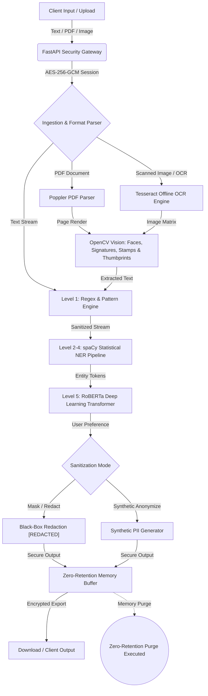

# RE-DACT : Advanced PII & Document Sanitization Platform
**Smart India Hackathon (SIH) & Enterprise Security Suite**

[](https://anustup55-redactx.hf.space)
[](https://anustup55-redactx.hf.space)
[](https://www.python.org/)
[](https://react.dev/)
[](https://opencv.org/)

> 🚀 **Experience the Live Web Application here:** [**https://anustup55-redactx.hf.space**](https://anustup55-redactx.hf.space)

`RE-DACT` is an enterprise-grade, offline-first data sanitization and anonymization platform. It enables organizations, cybersecurity teams, and compliance officers to detect, strip, and synthetically replace Personally Identifiable Information (PII) from unstructured text, complex PDFs, Office documents, and scanned images.

---

## 🚀 Key Architectural Highlights

- **100% Offline & Zero Third-Party API Dependency:** All OCR processing (Tesseract, Poppler), computer vision algorithms (OpenCV), and NLP transformer models execute entirely within your local environment or private cloud. No data ever leaves your secure perimeter.
- **Automated Visual PII & Biometric Redaction:** Integrates OpenCV Haar Cascade classifiers and morphological HSV contour analysis to automatically detect and de-identify **human faces, handwritten signatures, official ink stamps, seals, and thumbprints** in scanned images and PDF documents via irreversible Gaussian blurring.
- **Zero-Retention Protocol:** Documents and text inputs are processed entirely in memory and immediately discarded after sanitization. No original contents are persisted on disk or cached.
- **Gradational Anonymization (Levels 0–5):** Choose from baseline pass-through logging, pre-compiled regex pattern matching, progressive spaCy statistical NER layers, up to RoBERTa deep learning transformers.
- **In-Place Synthetic Anonymization:** Unlike basic black-box masking, Level 5 generates context-aware, grammatically identical synthetic data replacements (e.g., replacing a real Indian PAN, Aadhaar, or person name with a realistic dummy identifier).
- **Cross-Platform Deployment:** Build and deploy as a modern Progressive Web App (PWA), containerized Docker microservice, or self-contained offline Electron desktop app.

---

## 🏛️ System Architecture & Workflow

The platform follows a multi-stage defense-in-depth sanitization pipeline:



---

## 🧠 AI Models & Training Corpus

To achieve high precision without relying on external cloud APIs, `RE-DACT` utilizes custom-trained NLP models fine-tuned specifically for PII detection across diverse document formats:

### 1. Training Dataset (2.14 Lakh PII Records)
- **Corpus Volume:** Over **214,501 curated records** combining real-world compliance benchmarks and high-entropy synthetic data.
- **Domain Coverage:** Specialized training on Indian regulatory identifiers (**Aadhaar Cards, PAN Cards, Indian Bank Accounts, IFSC Codes, Indian Phone Numbers**), as well as global standards (SSNs, Credit Cards, IBANs, Email Addresses, Geolocation data).
- **Multilingual Support:** Trained on English, Spanish, German, and code-switched technical documentation.

### 2. Model Pipeline Stack
- **Regex & Deterministic Rules:** Ultra-fast regex compilation for structured financial and national identifiers (Level 1).
- **spaCy v3 Statistical NER:** Custom lightweight pipeline optimized for high-speed CPU inference without memory bloat (Levels 2–4).
- **RoBERTa Transformer Architecture:** Deep contextual embeddings fine-tuned for complex entity extraction, semantic disambiguation, and syntax-preserving synthetic data replacement (Level 5).

---

## 🛡️ Gradational Redaction Tiers

| Tier | Name | Technology | Best Used For |
| :--- | :--- | :--- | :--- |
| **Level 0** | **Pass-Through** | Baseline Logging | System verification and formatting validation without modification. |
| **Level 1** | **Pattern Scrubbing** | Pre-compiled Regex | High-speed stripping of structured numbers (PAN, Aadhaar, phone, email, URLs, figures). |
| **Level 2** | **Basic NER** | spaCy Statistical Model | Redacting standard personal names and primary organizations. |
| **Level 3** | **Intermediate NER** | spaCy + Regex Hybrid | Stripping names, organizations, geographical locations, and dates. |
| **Level 4** | **Strict NER** | Multi-layer Ensemble | Comprehensive removal of all identifying proper nouns and institutional markers. |
| **Level 5** | **Deep Learning / Synthetic** | Fine-tuned RoBERTa | Maximum security. Replaces sensitive PII in-place with realistic dummy data while preserving grammar. |

---

## 📁 Project Structure

```
SIH-REDACT-X/
├── backend/                # FastAPI Python Backend & AI Engines
│   ├── app/
│   │   ├── main.py         # Application Entrypoint & CORS Middleware
│   │   ├── models.py       # Pydantic Schemas & Data Validation
│   │   ├── database.py     # Asynchronous SQLite Zero-Retention History
│   │   └── routers/        # Authentication, History & Redaction Endpoints
│   ├── training/           # AI Training Scripts & Model Weights
│   │   ├── train_spacy_ner.py # Automated Training Pipeline (2.14 Lakh Dataset)
│   │   └── config.cfg      # spaCy v3 Optimization Config
│   ├── ner.py              # Named Entity Recognition Core Logic
│   ├── regex.py            # Pre-compiled Pattern RegEx Library
│   ├── ocr.py              # Tesseract Offline OCR Engine Integration
│   └── pdf.py              # Poppler PDF Parsing & Document Generation
├── src/                    # Frontend SPA & Desktop Source
│   ├── electron/           # Electron Main Process & Native OS Bridge
│   └── ui/                 # React 18 + TypeScript + Vite Frontend
│       ├── components/     # Reusable UI Modules (Sidebar, Header, RedactionCard)
│       ├── pages/          # Application Pages (Home, Login, Register, History, etc.)
│       └── store/          # Zustand State & Theme Management
├── public/                 # Static Assets & PWA Manifest
├── dockerfile              # Containerized Microservice Deployment
├── package.json            # Node Dependencies & Build Scripts
└── vite.config.ts          # Vite Bundler & PWA Configuration
```

---

## 🌐 Cloud Deployment & Permanent Storage

`RE-DACT` is designed for dual-mode persistence, seamlessly routing database queries depending on whether it is running locally on your computer or deployed to the cloud:

| Environment | App Hosting | Database Hosting | Permanence & Behavior |
| :--- | :--- | :--- | :--- |
| **Local PC / Electron** | Localhost / OS Native | **Local SQLite** (`form_data.db`) | **100% Permanent.** Stored directly on your hard drive; user accounts and history never disappear unless manually deleted. |
| **Cloud Live Demo** | **Hugging Face Spaces** (Docker) | **Turso Cloud LibSQL** or **`/data` Volume** | **100% Permanent.** When configured with Turso or a persistent volume, cloud container restarts or rebuilds will never wipe user data. |

### Connecting Turso Cloud Database (Free Permanent Storage):
To make your Hugging Face Space database permanent without paying for storage:
1. Create a free database at [**Turso**](https://turso.tech) (9 GB free forever LibSQL SQLite storage).
2. In your Hugging Face Space settings (**Settings -> Repository Secrets / Variables**), add two environment variables:
   * `TURSO_DATABASE_URL`: `libsql://your-database.turso.io`
   * `TURSO_AUTH_TOKEN`: `ey...` (Your Turso auth token)
3. The app will automatically detect Turso and route all user registrations, logins, and redaction history directly to permanent cloud storage!

---

## ⚡ Quick Start & Deployment

### Prerequisites
- **Node.js** (v18+ recommended)
- **Python** (3.9+ recommended)
- **Tesseract OCR** ([Download for Windows/Linux](https://github.com/tesseract-ocr/tesseract))
- **Poppler Utilities** ([Download binaries](https://poppler.freedesktop.org/))

### 1. Backend Setup
```bash
cd backend
python -m venv ../.venv
# On Windows:
..\.venv\Scripts\activate
# On Linux/macOS:
source ../.venv/bin/activate

pip install -r requirements.txt
uvicorn app.main:app --reload --port 8000
```

### 2. Frontend Setup
```bash
# In the project root directory
npm install
npm run dev
```

Access the web interface at `http://localhost:5173`. The UI automatically routes users through authenticated secure channels with distinct `# /home`, `# /login`, and `# /landing` routes.

### 3. Desktop Application (Electron)
```bash
npm run build
npm run start
```

---

## 🔒 Security & Compliance
- **Authentication:** JWT-based stateless session tokens with bcrypt salted password hashing.
- **CORS & Network:** Universal regex CORS middleware configured to prevent local networking conflicts.
- **Audit Logging:** Keeps track of the last 25 operations in an isolated local SQLite database for compliance reporting without storing document payloads.

---

## 📄 License
This project is licensed under the **MIT License**.

### 👨‍💻 Developer & Lead Architect
- **Name:** ANUSTUP MAITY
- **Contact:** [anustupmaity@gmail.com](mailto:anustupmaity@gmail.com)
